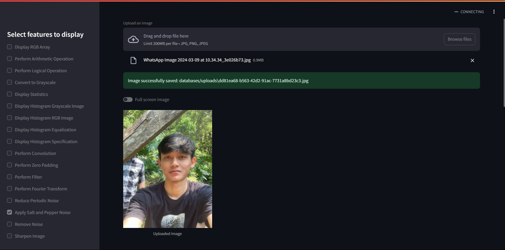
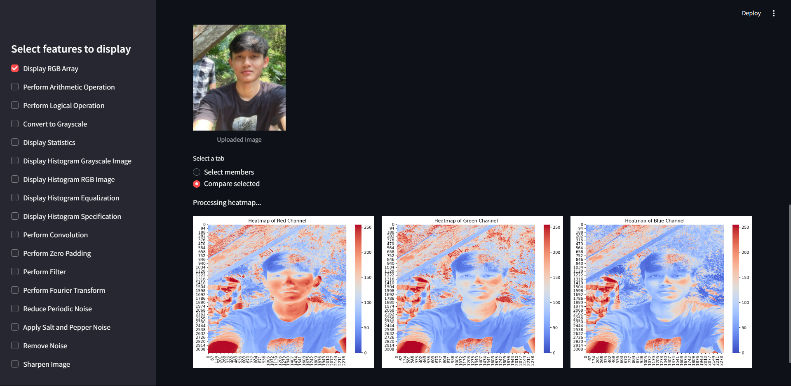
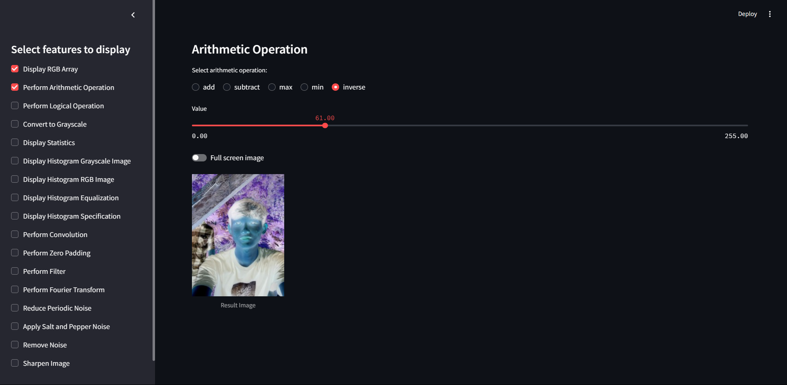
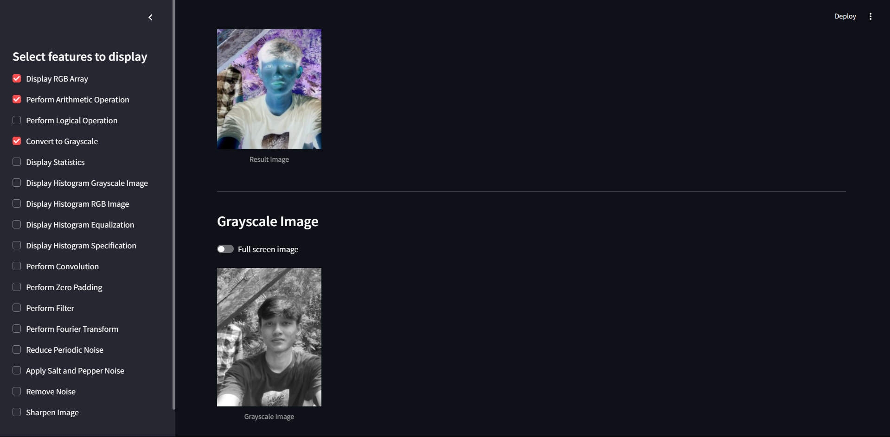
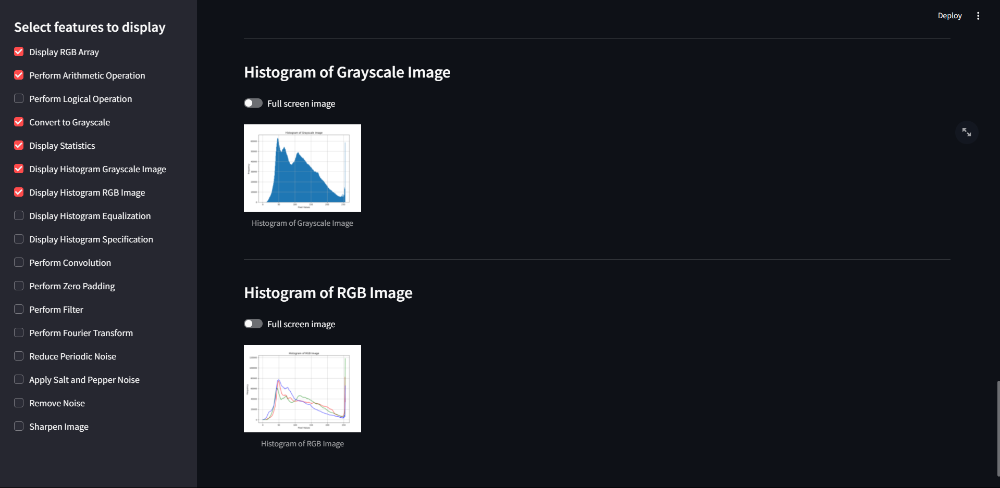
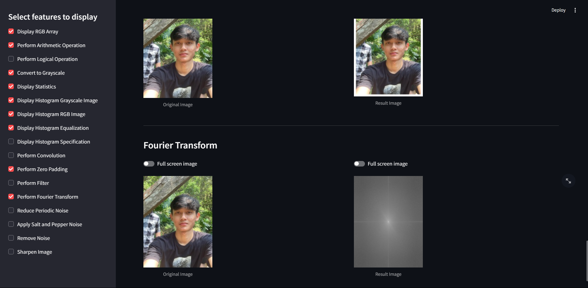

# Image Processing Application

## Deskripsi
Aplikasi ini adalah aplikasi pemrosesan citra berbasis web yang dikembangkan menggunakan Streamlit. Aplikasi ini memungkinkan pengguna untuk mengunggah gambar, menerapkan berbagai operasi pengolahan citra, dan melihat hasilnya dalam waktu nyata. Beberapa fitur yang tersedia meliputi pengolahan warna, konversi grayscale, histogram, operasi aritmatika dan logika, konvolusi, serta pengurangan noise.

Dikembangkan oleh **Roy Aziz Barera** - NIM 221524030.

## Preview







## Fitur Utama
Aplikasi ini dilengkapi dengan fitur-fitur berikut:

### 1. **Operasi Dasar Citra**
   - **Array RGB**: Menampilkan array RGB dari gambar yang diunggah.
   - **Operasi Aritmatika**: Menerapkan operasi aritmatika pada citra seperti penambahan, pengurangan, maksimum, minimum, dan inversi.
   - **Operasi Logika**: Menerapkan operasi logika AND, XOR, dan NOT pada citra.

### 2. **Konversi dan Statistik**
   - **Konversi Grayscale**: Mengonversi gambar berwarna menjadi gambar grayscale.
   - **Statistik Citra**: Menampilkan statistik dasar seperti mean, median, standar deviasi, varians, minimum, maksimum, dan lain-lain.

### 3. **Histogram**
   - **Histogram Grayscale**: Menampilkan histogram dari citra grayscale.
   - **Histogram RGB**: Menampilkan histogram dari citra RGB.
   - **Equalisasi Histogram**: Meningkatkan kontras citra melalui teknik ekualisasi histogram.
   - **Spesifikasi Histogram**: Menerapkan spesifikasi histogram dengan referensi dari gambar lain.

### 4. **Konvolusi dan Transformasi**
   - **Konvolusi**: Menerapkan kernel konvolusi seperti deteksi tepi, penajaman, dan rata-rata.
   - **Zero Padding**: Menambahkan padding di sekitar gambar dengan warna tertentu.
   - **Filter**: Menerapkan filter low-pass, high-pass, dan band-pass pada citra.
   - **Transformasi Fourier**: Menampilkan transformasi Fourier untuk analisis frekuensi.
   - **Pengurangan Noise Periodik**: Mengurangi noise periodik dari citra menggunakan filter frekuensi.

### 5. **Pengolahan Noise**
   - **Salt and Pepper Noise**: Menambahkan noise salt and pepper dengan warna tertentu.
   - **Pengurangan Noise**: Menghilangkan noise salt and pepper dari citra.
   - **Penajaman Citra**: Menerapkan penajaman citra untuk meningkatkan detail gambar.

## Persyaratan
- Python 3.x
- Modul-modul Python:
  - `streamlit`
  - `opencv-python`
  - `numpy`
  - `matplotlib`
  - `PIL`
  - `scikit-image`
  - `seaborn`
  - `pandas`

Anda dapat menginstal semua dependensi dengan perintah berikut:
```bash
pip install -r requirements.txt
```

## Instalasi
1. **Clone repositori**:
   ```bash
   git clone https://github.com/royazizbarera/image-processing-application
   ```
2. **Masuk ke direktori proyek**:
   ```bash
   cd image-processing-application
   ```
3. **Instal dependensi**:
   ```bash
   pip install -r requirements.txt
   ```


## Cara Menjalankan
1. **Pastikan berada di direktori proyek.**

2. **Jalankan aplikasi Streamlit**:
    ```bash
    streamlit run main.py
    ```

## Penggunaan
1.  **Unggah Gambar**: Klik tombol "Upload an image" untuk memilih gambar yang akan diproses.
2.  **Pilih Fitur**: Gunakan panel sisi kiri untuk memilih fitur pengolahan citra yang diinginkan.
3.  **Tampilkan Hasil**: Hasil akan langsung ditampilkan sesuai fitur yang dipilih.